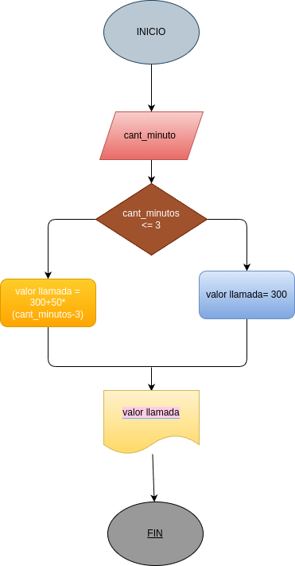

# Condicionales-1
 Condicionales # 1
 ## costo de una llamada telfonica 

 Ingresar el tiempo de una llamada telefonica y determinar la cantidad a pagar,de acuerdocon lo siguiente:
_ Toda llamada que dure un minuto o menos tiene un costo de 300 peos

_cada minuto adicional cuesta 50 pesos

# Analisis

## Imput

### Variables de entrada
cant_minutos:cantidad de minutos de la llamada 

## Processing
valor_llamada: calcular el valor final de la llamada
si es menor o igual a 3 minutos: el valor final ser de 300 pesos
si es mayor a 3 minutos : 300+50*(cant_minutoos-3)

### output
costo de la llamada
# Diseño

# Construccion

